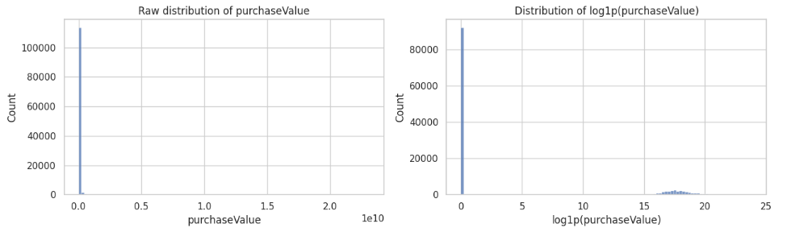
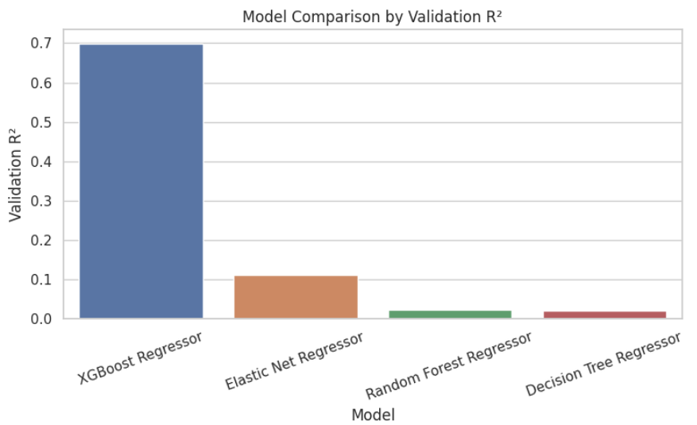
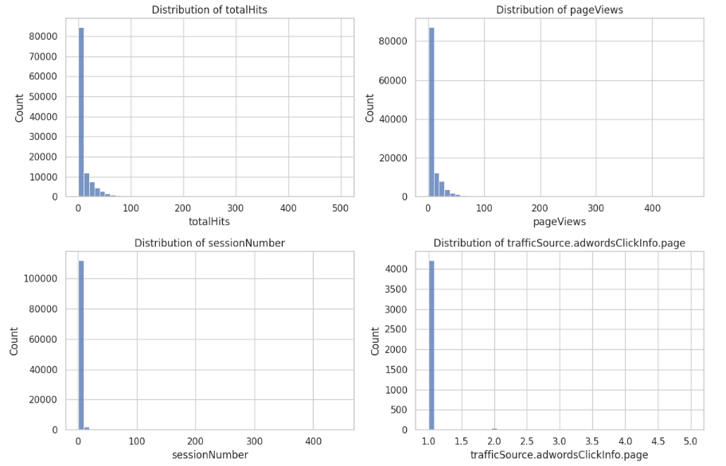

# Customer Purchase Value Prediction

This repository contains my final submission for the **Machine Learning Project course in the IIT Madras Diploma in Data Science**.

The project was developed through a Kaggle regression competition. The objective was to predict the purchase value generated by an anonymized e-commerce session using behavioral, acquisition-channel, device, and geographic features.

## Business objective

Predicting session-level purchase value can help a digital-commerce business:

- identify high-potential sessions and customers;
- prioritize marketing and engagement efforts;
- compare traffic and acquisition channels;
- allocate promotional resources more efficiently;
- understand which session characteristics are associated with higher purchase value.

## Dataset

Each row represents a unique user session.

- **Training observations:** 116,023
- **Test observations:** 29,006
- **Raw predictors:** 51
- **Target:** `purchaseValue`
- **Competition metric:** R²

Feature groups included:

- customer-engagement metrics;
- device and browser attributes;
- traffic and marketing-source information;
- geographic indicators;
- session date and timestamp variables.

The competition data are not included because they are subject to the competition rules.

## Project workflow

### Exploratory data analysis

The notebook examines:

- target distribution and zero-purchase prevalence;
- missing values and feature cardinality;
- numerical-feature distributions;
- correlation with purchase value;
- selected categorical relationships;
- temporal patterns;
- outlier behavior.

### Data preparation

The project includes:

- placeholder-value replacement;
- missing-value imputation;
- removal of constant and highly incomplete features;
- treatment of high-cardinality attributes;
- date-derived feature engineering;
- numerical scaling;
- categorical encoding.

### Model development

Four standalone regression workflows were retained because the course project required a primary model and additional comparison models.

**Primary model**

- XGBoost Regressor
- Randomized hyperparameter search
- Mixed numerical and categorical preprocessing
- Training-only oversampling for non-zero purchases
- Validation on an untouched holdout set

**Secondary models**

- Random Forest Regressor
- Decision Tree Regressor
- Elastic Net Regressor

All reported validation metrics in the cleaned notebook are calculated on the original `purchaseValue` scale.

## Key Visuals

### Target Distribution

The target variable was highly skewed, with many low or zero-purchase sessions and a smaller number of high-value sessions.



### Model Comparison

XGBoost achieved the strongest validation R² among the four evaluated workflows.



### Feature Importance

The XGBoost model captured nonlinear relationships across engagement, traffic-source, device, and geographic variables.



## Results

- **Corrected XGBoost holdout R²:** `0.6994`
- **Corrected XGBoost holdout MAE:** `26758348.63`
- **Corrected XGBoost holdout RMSE:** `102667729.74`
- **Final Kaggle score:** `0.59254`
- **Final rank:** `426` out of `1790`
- **Placement:** Top `24%`

### Best XGBoost parameters:
- The best-performing XGBoost configuration identified through randomized hyperparameter search was:

```python
{
    "colsample_bytree": 0.658,
    "gamma": 0.147,
    "learning_rate": 0.1086,
    "max_depth": 9,
    "min_child_weight": 4,
    "n_estimators": 282,
    "subsample": 0.905
}
```

## Repository structure

```text
customer-purchase-value-prediction/
├── README.md
├── requirements.txt
├── .gitignore
└── notebooks/
    └── customer_purchase_value_prediction.ipynb
```

## Technologies

Python · pandas · NumPy · Matplotlib · seaborn · scikit-learn · XGBoost · category_encoders

## Academic context

This was the final submission for the **Machine Learning Project course in the IIT Madras Diploma in Data Science**. The notebook has been reorganized for public portfolio presentation while retaining the four model workflows used in the course project.
